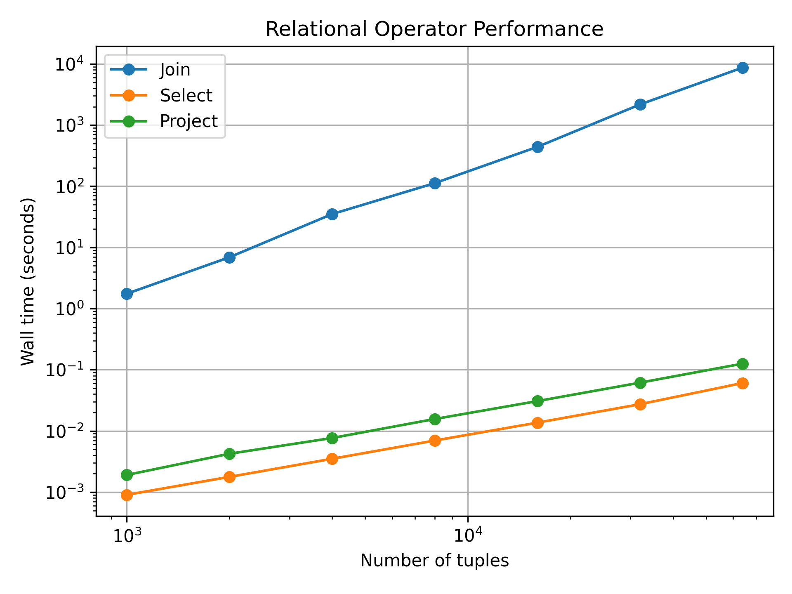

Performance Report

1. Overview

This report evaluates the performance of my relational algebra engine. The main goal of the testing was to compare the behaviour of the nested-loop theta join with simpler relational operators such as selection and projection.

The engine was implemented in Python without using database libraries, pandas, NumPy, SQL engines, or built-in relational algebra operations.

The performance measurements include:
- theta join at seven input sizes
- selection at the same seven sizes
- projection at the same seven sizes
- the effect of changing the join match rate
- a prediction for a join involving one million tuples on each side

All timing measurements were taken using time.perf_counter().

2. System Information

The experiments were run on a Windows laptop.

Language: Python
Python version: 3.11.1
Join implementation: nested-loop join
Data storage: in-memory Python objects

No indexes, hash joins, sort-merge joins, or query optimizations were used.

3. Join Benchmark

The query used for the main join experiment was:

R join[R.b=S.b] S

Both relations were generated with the same number of tuples for each test.

The join implementation uses nested loops. Every tuple in R is compared with every tuple in S.

Results

n        m        Comparisons        Wall Time (seconds)        Output Tuples
1,000    1,000    1,000,000          1.746642                   1,000
2,000    2,000    4,000,000          6.902448                   2,000
4,000    4,000    16,000,000         35.038906                  4,000
8,000    8,000    64,000,000         112.305770                 8,000
16,000   16,000   256,000,000        439.774611                 16,000
32,000   32,000   1,024,000,000      2171.982749                32,000
64,000   64,000   4,096,000,000      8712.435958                64,000

The 64,000 by 64,000 join took approximately 2.42 hours to complete.

4. Relationship Between n, m, and Comparisons

For my nested-loop join, the number of condition evaluations is exactly:

comparisons = n x m

where:
n is the number of tuples in R
m is the number of tuples in S

For example, the 32,000 by 32,000 experiment performed:

32,000 x 32,000 = 1,024,000,000 comparisons

The measured counter produced exactly this value.

The same relationship was observed at every tested size.

When both relation sizes are doubled:

(2n)(2m) = 4nm

Therefore, doubling both relations causes approximately four times as many comparisons.

This explains why the join runtime grows much faster than the size of either individual input relation.

5. Log-Log Performance Analysis

I compared input size against wall time using logarithmic values.

A linear fit on the log-log measurements gave an approximate slope of:

Join slope approximately 2.04

A slope near 2 indicates quadratic growth.

This closely matches the expected complexity of the nested-loop join:

O(n x m)

Since my experiment uses equal-sized relations where n = m, the complexity can also be written as:

O(n^2)

The measured results therefore agree closely with the theoretical behaviour of the implementation.

The timings do not increase by exactly four times at every individual step because wall-clock measurements can also be affected by factors such as interpreter overhead, memory allocation, result construction, and normal variation in the machine. However, the overall growth trend is clearly quadratic.

 Log-Log Performance Plot

The plot shows that selection and projection grow much more slowly than the nested-loop join. Selection and projection are approximately linear, while the join curve follows approximately quadratic growth.

6. Selection and Projection Benchmark

Selection and projection were tested using the same input sizes as the join.

For the selection benchmark, I used:

select[a<0](R)

The generated values of a were non-negative, so no tuples matched the condition.

This was intentional. The evaluator still had to examine every input tuple, which allowed the selection counter to measure the scan without the timing being dominated by constructing a large output relation.

For projection, I used:

project[b](R)

The generated b values repeated across ten possible values, causing the projection result to contain 10 distinct tuples.

Results

Input Tuples    Selection Examinations    Selection Time (s)    Selection Output    Projection Time (s)    Projection Output
1,000           1,000                     0.000901              0                   0.001904               10
2,000           2,000                     0.001772              0                   0.004230               10
4,000           4,000                     0.003499              0                   0.007652               10
8,000           8,000                     0.006953              0                   0.015640               10
16,000          16,000                    0.013635              0                   0.030696               10
32,000          32,000                    0.027283              0                   0.061421               10
64,000          64,000                    0.060652              0                   0.125770               10

The approximate log-log slopes were:

Selection slope approximately 1.00
Projection slope approximately 1.00
Join slope approximately 2.04

Selection grows approximately linearly because each tuple is examined once.

Projection also shows approximately linear growth in this experiment because each input tuple must be visited and projected.

The major difference is that join considers combinations of tuples from two relations. Therefore, while select and project grow approximately proportionally to the input size, the nested-loop join grows approximately with the square of the input size when both relations have equal size.

7. Match Rate Experiment

I also tested whether changing the number of matching tuples affects the nested-loop join.

For this experiment, both relations contained 4,000 tuples.

The number of comparisons was therefore expected to remain:

4,000 x 4,000 = 16,000,000

for every experiment.

Results

Match Rate    Comparisons      Wall Time (s)    Output Tuples
1             16,000,000       29.438395        4,000
2             16,000,000       41.512515        8,000
4             16,000,000       63.032363        16,000
8             16,000,000       163.216828       32,000

Changing the match rate did not change the comparison count.

This happens because the nested-loop algorithm does not know in advance whether two tuples will match. It still examines every possible pair.

However, changing the match rate did affect the wall time.

At match rate 1, the engine produced 4,000 output tuples and took about 29.44 seconds.

At match rate 8, it produced 32,000 output tuples and took about 163.22 seconds.

The additional time comes from processing, constructing, checking, and storing a much larger number of result tuples.

Therefore, the number of pair comparisons is independent of the match rate, but the total runtime can still increase when more tuples satisfy the join condition.

8. Prediction for a 1,000,000 x 1,000,000 Join

A join between two relations containing one million tuples each would require:

1,000,000 x 1,000,000 = 1,000,000,000,000 comparisons

This is one trillion tuple-pair comparisons.

I used the measured 64,000 by 64,000 result to estimate the runtime.

The measured 64,000 experiment required:

4,096,000,000 comparisons

and took:

8712.435958 seconds

The ratio between one million tuples and 64,000 tuples is:

1,000,000 / 64,000 = 15.625

Because the join is approximately quadratic, the estimated increase in work is:

15.625^2 = 244.140625

The estimated runtime is therefore:

8712.435958 x 244.140625
approximately 2,127,060 seconds

This is approximately:

590.85 hours

or:

24.6 days

Therefore, based on my measurements, a one-million by one-million nested-loop join would take roughly 25 days on the same system.

This is only a prediction, since I did not actually run the one-million tuple experiment.

9. Making the Million-Tuple Join Feasible

The current implementation is useful for demonstrating relational algebra semantics, but a nested-loop join does not scale well to very large relations.

A more practical implementation could use a hash join for equality conditions such as:

R.b = S.b

Instead of comparing every tuple from R with every tuple from S, one relation could first be organized into a hash table using the join attribute.

The other relation could then look up matching values directly.

For an equality join, this could reduce the expected work from approximately O(n x m) to approximately O(n + m) under typical hash-table assumptions.

Other improvements could include:
- indexes on commonly joined attributes
- sort-merge joins
- choosing different join algorithms depending on the condition
- reducing intermediate results before joining
- applying selections as early as possible
- projecting unnecessary columns before expensive operations
- more efficient internal tuple storage

A real database query optimizer would choose strategies like these rather than always performing a full nested-loop comparison.

10. Conclusion

The performance experiments showed a clear difference between simple relational operators and the nested-loop join.

Selection and projection both had log-log slopes close to 1, showing approximately linear growth in these experiments.

The join had a measured slope of approximately 2.04, which is very close to the quadratic growth expected from a nested-loop implementation.

The comparison counter also confirmed that the join performs exactly n x m condition evaluations.

Changing the match rate did not change this comparison count, although it increased wall time because more result tuples had to be constructed.

Finally, measurements from the 64,000 tuple experiment predict that joining two relations containing one million tuples each would take approximately 25 days using the current implementation.

This demonstrates why database systems require more efficient join algorithms and query optimization techniques for large datasets.